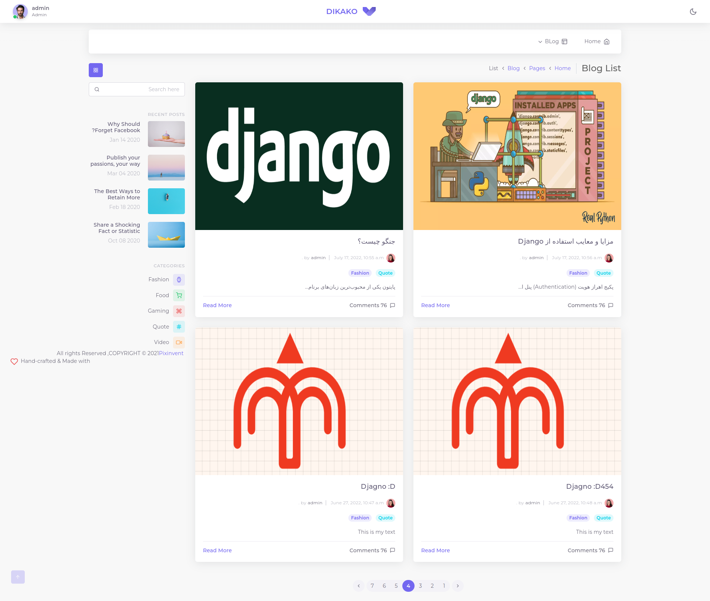
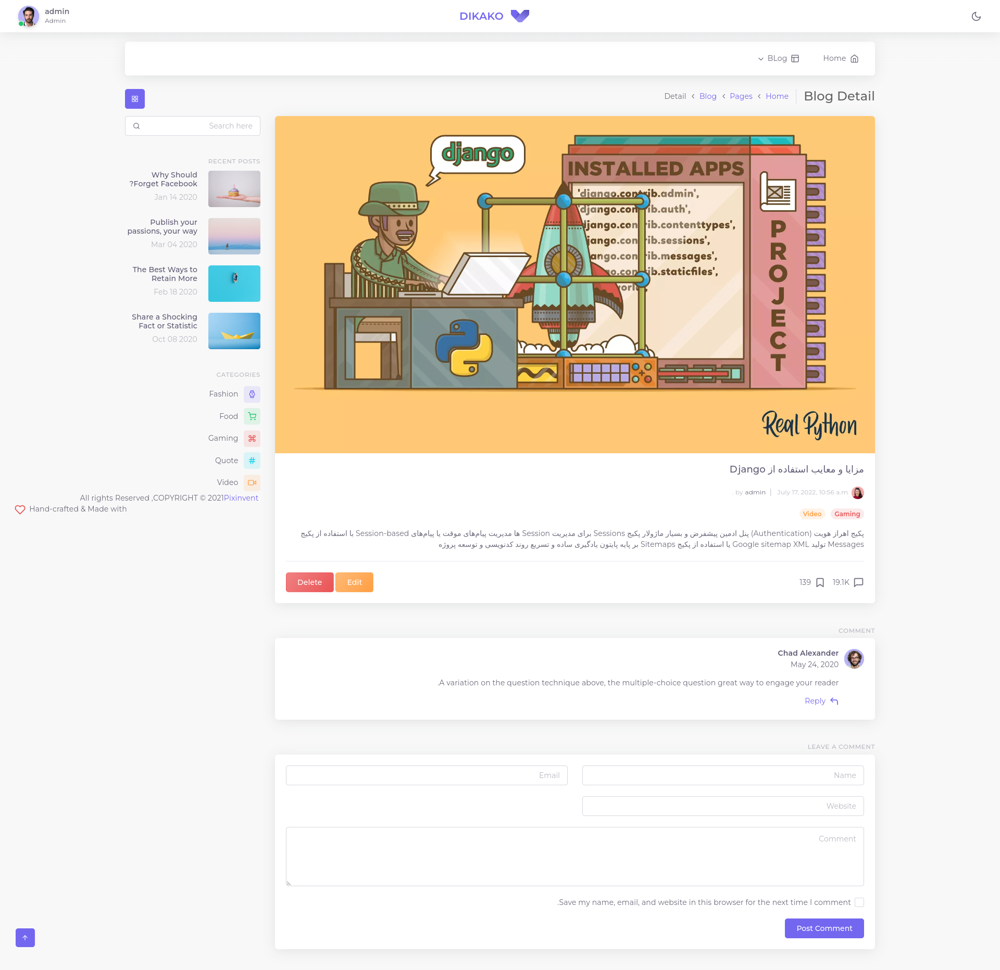
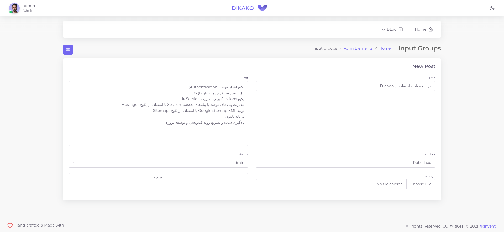

# Blog application

### Demo https://blog.mammadsafar.ir/blog/

## Post_List

## Post_Details

## Post_Update


## Setup

The first thing to do is to clone the repository:

```sh
$ git clone https://github.com/mammadsafar/django_Weblog.git
$ cd django_Weblog
```
You can run in docker:
```sh
$ docker-compose up -d --build
```
And navigate to `http://127.0.0.1:8000` .

OR:

Create a CONDA environment to install dependencies in and activate it:

```sh
$ conda create -n blog python=3.9
$ conda activate blog
```

Then install the dependencies:

```sh
(blog)$ pip install -r requirements.txt
```
Note the `(env)` in front of the prompt. This indicates that this terminal
session operates in a virtual environment set up by `virtualenv2`.

Once `pip` has finished downloading the dependencies:
```sh
(blog)$ cd project
(blog)$ python manage.py runserver
```
And navigate to `http://127.0.0.1:8000/blog/postlist`.
